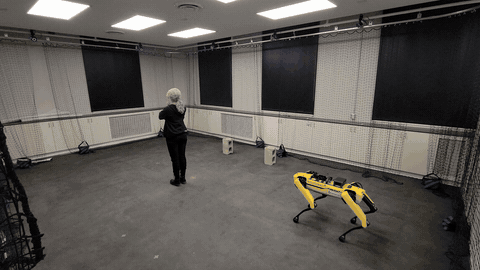

# EnhancingRobotNavigation

> **Note:** All code in this repository was written by Kleber Cabral. The README documentation and inline code comments were added with AI assistance (Claude).

Code for **"Enhancing Robot Navigation in Crowded Spaces Through Systematic Strategy
Selection"** (IEEE SysCon 2025), by Kleber Cabral, Jean-Alexis Delamer, Jefferson
Silveira, and Sidney N. Givigi. Validated on a real Boston Dynamics Spot robot.

**Paper:** [doi:10.1109/SysCon64521.2025.11014789](https://doi.org/10.1109/SysCon64521.2025.11014789) ·
**Slides:** [presentation/SysCon2025_slides.pdf](presentation/SysCon2025_slides.pdf)

*The best real-robot run, at 2x speed (full video: `media/best_run_demo.mp4`).*

## What it does

A ROS node (`commands_node.py`) tracks the robot and a set of moving exclusion zones
(other agents/obstacles), and selects between navigation strategies ("tactics",
weighted differently over multiple cost terms — `weightsEqual`/`A`/`B`/`C`) based on the
current situation, then runs the selected policy (a SAC actor exported to ONNX,
`my_sac_actor.onnx`) via `onnxruntime` inference to publish `Twist` velocity commands to
the Spot robot (`/spot/cmd_vel`).

## Structure

- `src/` — the ROS/RL source:
  - `commands_node.py` — main ROS node: exclusion-zone tracking, strategy/tactic
    selection, ONNX policy inference, velocity command publishing.
  - `core.py` — the exclusion-zone / particle environment logic (`gymnasium`-based).
  - `Auxiliar.py` — helpers built on `stable_baselines3` (SAC).
  - `fastCMDvel.py` — a small relay node republishing `/spot/slow/cmd_vel` onto
    `/spot/cmd_vel` at a fixed rate.
  - `topic_to_pickle.py` — records ROS topics (position/velocity/markers) to pickle
    files during an experiment run — this is what produced `data/*.pkl`.
  - `export_to_onnx_trained_models.py`, `inference_test.py` — export a trained
    `stable_baselines3` SAC policy to ONNX, and a standalone sanity check for running
    the exported model.
  - `my_sac_actor.onnx` — one exported policy.
  - `models/tactic1|2|3/tactic*.zip` — the three trained tactic policies
    (stable_baselines3 SAC checkpoints) that `commands_node.py` loads via `SAC.load()`
    for strategy selection.
  - `config/myconfig.rviz` — RViz visualization config used during the real-robot runs.
- `data/` — `position_data.pkl` / `experiment_data.pkl` from a real Spot experiment run.
- `media/best_run_demo.mp4` — a rendered video of the best real-Spot experimental run
  (`2024-11-15-22-11-27`).
- `figures/` — paper figures (trajectory/cost/tactic-selection plots, system diagram,
  experiment photos).
- `presentation/SysCon2025_slides.pdf` — the conference talk slides (embedded videos appear as
  still frames; see `media/best_run_demo.mp4` for the run itself).

## Credits

`figures/spot.png` is a product image of the Spot robot by Boston Dynamics, used in the
paper's illustrations; it is not covered by this repository's license.

## Not included

Raw Spot-robot rosbags (~605MB) are not in git because of their size; `data/*.pkl` holds
the extracted position/experiment data used for the paper's figures.

## Status

Paper code (SysCon 2025) — archival, not actively maintained. Model paths are relative
to the repo, so `commands_node.py` finds `models/` without editing.
